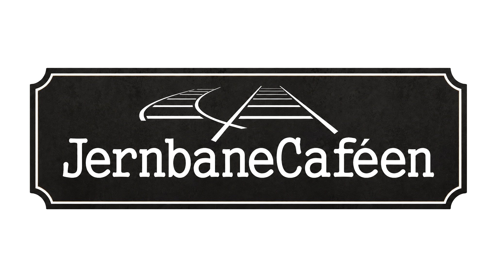

# Jernbane Cafeen — Designsystem

Baseret på Mellows struktur og animationer, tilpasset Jernbane Cafeens identitet: varm, hjemlig og uformel stationscafé i Ikast med fokus på hygge, sæsonmad og catering.

---

## Tone og stemning

> "Hyggeligt stationscafe, med dejlig mad og drikke."

Sproget er nede på jorden, varmt og inviterende — som selve cafeen. Ingen formalia. Det er naboens café, ikke en fine dining-restaurant. Teksten taler direkte og venligt til gæsten — som om man allerede kender dem.

**Jernbane Cafeens to primære budskaber:**
1. **Caféen** — daglig frokost, sæsonmenuer, tapas og en god kop kaffe
2. **Catering & selskaber** — mad til fester, firmaarrangementer og events (transportabel eller i cafeen, plads til ca. 40)

Begge skal have plads på forsiden. Catering-sektionen kan sidde som anden eller tredje sektion — det er et vigtigt forretningsben.

---

## Farvepalette

### Princippet
Jernbane Cafeen har en mørk, skifer-lignende logo-baggrund og en varm teglstens-facade. Paletten afspejler dette: **varm fløde er grundtonen**, det mørke skifer bruges til hero, footer og fremhævede sektioner. Amber/rav er accentfarven — det minder om varmt lys på træ og jernbane-lanterner.

```css
:root {
  /* Primær baggrund — varm fløde/creme */
  --c-cream:        #F2EDE4;
  --c-cream-warm:   #E8E0D4;

  /* Tekst */
  --c-ink:          #1E1C1A;   /* nær sort — som logoets skifer */
  --c-ink-soft:     #5C4A38;   /* varm mellembrun til sekundær tekst */
  --c-light-text:   #F5F1EB;   /* lys tekst på mørk baggrund */

  /* Mørke sektioner — skifer (matchende logo) */
  --c-dark:         #1E1C1A;
  --c-mid:          #2E2A26;

  /* Accent — varm rav/amber (jernbane-lanterner, varmt træ) */
  --c-accent:       #C4862A;

  /* CTA — dyb rust/terrakotta (teglsten, varm og jordnær) */
  --c-cta:          #7A3B1E;

  /* Borders og linjer */
  --c-rule:         rgba(30, 28, 26, 0.12);    /* på lys baggrund */
  --c-rule-light:   rgba(245, 241, 235, 0.18); /* på mørk baggrund */
}
```

### Farveregel — vigtig
- `--c-cta` (#7A3B1E) bruges **aldrig** som sektionsbaggrund — kun CTA-knapper og footer-detaljer
- `--c-accent` (#C4862A) er amber-tonen til separatorlinjer, ikoner, fremhævet tekst og dekorative elementer
- `--c-dark` (#1E1C1A) bruges til hero (mørk halvdel), footer og fremhævede sektioner
- Fløde/creme (#F2EDE4) er grundtonen og sætter den hyggelige stemning

---

## Typografi

Display-fonten skal have karakter og varme — **Lora** er det primære valg: det er et serif med en organisk, håndskrevet kvalitet der passer perfekt til en hjemlig café. Body-font er **Outfit** — let og neutralt.

```css
:root {
  --f-display: "Lora", "Playfair Display", Georgia, serif;
  --f-body:    "Outfit", -apple-system, "Helvetica Neue", sans-serif;
}
```

### Typografiskala

| Klasse | Font | Størrelse | Vægt | Letter-spacing | Transform | Brug |
|---|---|---|---|---|---|---|
| `h1` / `.display` | display | clamp(34px, 5vw, 68px) | 400 | — | — | Hero-overskrifter |
| `h2` | display | clamp(28px, 4vw, 52px) | 400 | — | — | Sektionsoverskrifter |
| `h3` | display | 26px | 400 | — | — | Underoverskrifter |
| `.eyebrow` | body | 11px | 500 | 0.20em | UPPERCASE | Kategori-labels |
| `.body-lg` | body | 17px | 300 | — | — | Manchetafsnit |
| `.body` | body | 15px | 400 | — | — | Brødtekst |
| `.caption` | body | 12px | 300 | 0.04em | — | Billedtekster |

**Særlige typografimønstre:**
- `.eyebrow`: 11px, uppercase, 0.20em letter-spacing, farve: `--c-accent`
- `text-wrap: balance` på display-overskrifter
- `text-wrap: pretty` på `.body-lg`
- Kursiv bruges til stemning og citater i display-fonten
- Lora's kursiv er særligt smuk — brug den til taglines og citater

---

## Navigation

Fast navigation øverst, højde 72px. Glaseffekt med fløde-baggrund på lyse sektioner, skifer på mørke.

```css
:root {
  --nav-h: 72px;
}

.nav {
  position: fixed;
  top: 0;
  left: 0;
  right: 0;
  height: var(--nav-h);
  z-index: 100;
  display: grid;
  grid-template-columns: 1fr auto 1fr;
  align-items: center;
  padding: 0 40px;
  background: rgba(242, 237, 228, 0.92);
  backdrop-filter: blur(14px);
  -webkit-backdrop-filter: blur(14px);
  border-bottom: 1px solid var(--c-rule);
  transition: background 0.4s var(--ease);
}

/* Mørk variant — til hero og mørke sektioner */
.nav.is-dark {
  background: rgba(30, 28, 26, 0.92);
  border-bottom-color: var(--c-rule-light);
}

/* Indlæsningsanimation */
.nav {
  opacity: 0;
  transform: translateY(-12px);
  transition: opacity 0.7s var(--ease), transform 0.7s var(--ease);
}
.nav.is-loaded {
  opacity: 1;
  transform: none;
}
```

**Navigationslinks — hover-understregning:**
```css
.nav-link {
  position: relative;
  font-size: 11px;
  letter-spacing: 0.18em;
  text-transform: uppercase;
  color: var(--c-ink);
}
.nav-link::after {
  content: '';
  position: absolute;
  bottom: -2px;
  left: 0; right: 0;
  height: 1px;
  background: var(--c-accent);
  transform: scaleX(0);
  transform-origin: left;
  transition: transform 0.3s var(--ease);
}
.nav-link:hover::after {
  transform: scaleX(1);
}
```

**Links:**
- Menukort
- Catering
- Om cafeen
- Kontakt
- `<a class="btn-solid">Book bord</a>`

**Burger vises ved ≤1040px.**

---

## Hero — split layout

Venstre side: stort billede af cafeen/maden med mørkt overlay og tagline. Højre side: mørk skifer-baggrund med logo og intro-tekst. Dette afspejler logoets mørke karakter og giver et stærkt, karakterfuldt første indtryk.

```html
<section class="hero" data-tone="dark">
  <div class="hero-left">
    <!-- Brug et stemningsbillede: cafeens facade, interiør eller en ret -->
    
    <div class="hero-overlay"></div>
    <p class="hero-tagline">Hyggeligt stationscafé.<br><em>Dejlig mad. Godt selskab.</em></p>
    <div class="scroll-cue">
      <div class="scroll-arrow"></div>
    </div>
  </div>
  <div class="hero-right reveal">
    
    <p class="eyebrow">Café & Catering · Ikast</p>
    <p class="body-lg">Velkommen indenfor. Vi serverer sæsonens bedste — til hverdag og fest.</p>
    <a href="#menu" class="btn-outline">Se vores menukort</a>
  </div>
</section>
```

```css
.hero {
  display: grid;
  grid-template-columns: 60fr 40fr;
  min-height: 100svh;
}

.hero-left {
  position: relative;
  overflow: hidden;
}

/* Billede med parallax — ikke video */
.hero-left img {
  position: absolute;
  inset: 0;
  width: 100%;
  height: 115%;  /* ekstra højde til parallax */
  object-fit: cover;
  will-change: transform;
}

.hero-overlay {
  position: absolute;
  inset: 0;
  background: linear-gradient(
    180deg,
    rgba(30, 28, 26, 0.25),
    transparent 25%,
    transparent 65%,
    rgba(30, 28, 26, 0.55)
  );
}

.hero-tagline {
  position: absolute;
  bottom: 32px;
  left: 44px;
  right: 44px;
  font-family: var(--f-display);
  font-size: clamp(18px, 2.2vw, 26px);
  font-style: normal;
  color: var(--c-light-text);
  text-shadow: 0 2px 28px rgba(0, 0, 0, 0.55);
  line-height: 1.4;
  animation: heroIn 1.2s var(--ease) 0.9s both;
}

.hero-tagline em {
  font-style: italic;
  color: rgba(196, 134, 42, 0.9);  /* amber på mørk baggrund */
}

/* Højre side: mørk skifer — matcher logoets karakter */
.hero-right {
  display: flex;
  flex-direction: column;
  align-items: flex-start;
  justify-content: center;
  padding: 64px 52px;
  background: var(--c-dark);
  gap: 24px;
  animation: heroIn 1.2s var(--ease) 0.45s both;
}

.hero-right .eyebrow { color: var(--c-accent); }
.hero-right .body-lg { color: rgba(245, 241, 235, 0.85); }

.hero-logo {
  width: clamp(180px, 14vw, 240px);
  height: auto;
  /* Logoet er allerede mørkt med hvid tekst — virker godt på skifer */
}

@media (max-width: 880px) {
  .hero {
    grid-template-columns: 1fr;
  }
  .hero-left {
    aspect-ratio: 4 / 3;
    min-height: 0;
  }
  .hero-right {
    padding: 48px 28px;
  }
}
```

---

## Animationer og overgange

Identiske med Mellow — backbone bevares.

```css
:root {
  --ease:   cubic-bezier(0.33, 1, 0.68, 1);
  --t-fast: 0.3s var(--ease);
  --t-slow: 0.7s var(--ease);
}

@keyframes heroIn {
  from {
    opacity: 0;
    transform: translateY(20px);
  }
  to {
    opacity: 1;
    transform: none;
  }
}

@keyframes fadeUp {
  from {
    opacity: 0;
    transform: translateY(12px);
  }
  to {
    opacity: 1;
    transform: none;
  }
}

@keyframes scrollArrow {
  0%   { opacity: 0; transform: translateY(-20px); }
  40%  { opacity: 1; transform: translateY(0); }
  100% { opacity: 0; transform: translateY(20px); }
}
```

### Scroll-reveal

```css
.reveal {
  opacity: 0;
  transform: translateY(20px);
  transition: opacity 0.7s var(--ease), transform 0.7s var(--ease);
}
.reveal.is-in {
  opacity: 1;
  transform: none;
}

/* Stagger-forsinkelser via data-attribut */
.reveal[data-delay="1"] { transition-delay: 0.08s; }
.reveal[data-delay="2"] { transition-delay: 0.16s; }
.reveal[data-delay="3"] { transition-delay: 0.24s; }
.reveal[data-delay="4"] { transition-delay: 0.32s; }
```

### Hover-overgange

```css
/* Billeder */
.pair-frame img {
  transition: transform 1.2s var(--ease);
}
.pair-frame:hover img {
  transform: scale(1.03);
}

/* Knapper med pil */
.btn-ghost .arrow {
  width: 28px;
  transition: width 0.3s var(--ease);
}
.btn-ghost:hover .arrow {
  width: 44px;
}
```

---

## Scroll-cue (pil-animation)

```html
<div class="scroll-cue">
  <div class="scroll-arrow"></div>
</div>
```

```css
.scroll-arrow {
  width: 1px;
  height: 38px;
  background: linear-gradient(to bottom, transparent, var(--c-light-text));
  animation: scrollArrow 2.4s var(--ease) infinite;
}
```

---

## Sektionslayout og grid

### Sektionsafstand

```css
.section-pad    { padding: 120px 0; }
.section-pad-sm { padding: 80px 0; }
```

### Max-bredder

```css
.col-narrow   { max-width: 640px;  margin-inline: auto; }
.col-medium   { max-width: 720px;  margin-inline: auto; }
.col-wide     { max-width: 1100px; margin-inline: auto; }
.col-full     { max-width: 1200px; margin-inline: auto; }
```

### Info-strip (3 kolonner med borders)

Bruges til nøglefakta — fx adresse, telefon, åbningstider.

```css
.info-strip {
  display: grid;
  grid-template-columns: repeat(3, 1fr);
  border-top: 1px solid var(--c-rule);
  border-bottom: 1px solid var(--c-rule);
}
.info-strip > * {
  padding: 44px 40px;
  border-right: 1px solid var(--c-rule);
}
.info-strip > *:last-child { border-right: none; }

@media (max-width: 720px) {
  .info-strip { grid-template-columns: 1fr; }
  .info-strip > * { border-right: none; border-bottom: 1px solid var(--c-rule); }
}
```

**Indhold til info-strip:**
- 📍 Li Torv 3, Ikast — *Lige ved stationen*
- 🕐 Åbningstider — *Se aktuelle tider*
- 📞 30 80 72 41 · info@jbcafeen.dk

### Billedpar med offset

```css
.pair {
  display: grid;
  grid-template-columns: 1fr 1fr;
}
.pair-frame {
  aspect-ratio: 4 / 5;
  overflow: hidden;
}
.pair-frame img {
  width: 100%; height: 100%;
  object-fit: cover;
  display: block;
}

/* Offset-varianter */
.pair.offset-left  .pair-frame:first-child { margin-top: 80px; }
.pair.offset-right .pair-frame:last-child  { margin-top: 80px; }

@media (max-width: 880px) {
  .pair { grid-template-columns: 1fr; }
  .pair.offset-left  .pair-frame:first-child,
  .pair.offset-right .pair-frame:last-child { margin-top: 0; }
}
```

### Menu-grid (3 kolonner — frokost, tapas, catering)

```css
.menu-grid {
  display: grid;
  grid-template-columns: repeat(3, 1fr);
  border-top: 1px solid var(--c-rule);
}
.menu-card {
  padding: 48px 40px;
  border-right: 1px solid var(--c-rule);
  transition: background 0.3s var(--ease);
}
.menu-card:last-child { border-right: none; }
.menu-card:hover { background: rgba(196, 134, 42, 0.06); }

/* Ikon/emblem til hvert menukort */
.menu-card .menu-icon {
  font-size: 28px;
  margin-bottom: 20px;
  display: block;
  color: var(--c-accent);
}

@media (max-width: 880px) {
  .menu-grid { grid-template-columns: 1fr; }
  .menu-card { border-right: none; border-bottom: 1px solid var(--c-rule); }
}
```

**Indhold til menu-grid:**
- **Frokostmenu** — Klassikere med sæsonens touch. Dagens ret skifter.
- **Tapas** — Perfekt til deling. Forårsstemning på gaflen.
- **Catering** — Vi bringer maden hjem til jer. Op til ca. 40 pers. i cafeen.

### Catering-sektion (mørk baggrund, amber-accenter)

```css
.catering-section {
  background: var(--c-dark);
  color: var(--c-light-text);
  padding: 120px 0;
}

.catering-section .eyebrow {
  color: var(--c-accent);
}

.catering-section h2 {
  color: var(--c-light-text);
}

.catering-section .body-lg {
  color: rgba(245, 241, 235, 0.80);
}

/* Lys separator-linje i amber */
.catering-section .separator {
  width: 48px;
  height: 1px;
  background: var(--c-accent);
  margin: 24px 0;
}
```

**Indhold til catering-sektion:**
- Eyebrow: "Catering & Selskaber"
- H2: "Vi bringer hyggen hjem til jer"
- Body: Autentisk mad til jeres fest — transportabel eller i cafeen. Plads til ca. 40 gæster. Thai, tapas og sæsonmad.
- CTA-knap: "Få et tilbud"

### Footer

```css
.footer {
  background: var(--c-mid);  /* lidt lysere end pitch-sort */
  color: var(--c-light-text);
  padding: 80px 0 40px;
  border-top: 1px solid rgba(196, 134, 42, 0.25);  /* amber top-border */
}
.footer-grid {
  display: grid;
  grid-template-columns: 2fr 1fr 1fr;
  gap: 56px;
  max-width: 1100px;
  margin-inline: auto;
  padding-inline: 40px;
}
.footer h4 {
  font-size: 11px;
  letter-spacing: 0.22em;
  text-transform: uppercase;
  color: var(--c-accent);
  margin-bottom: 16px;
}
.footer p, .footer address {
  font-style: normal;
  color: rgba(245, 241, 235, 0.7);
  font-size: 14px;
  line-height: 1.8;
}
.footer a {
  color: rgba(245, 241, 235, 0.7);
  transition: color 0.3s;
}
.footer a:hover { color: var(--c-light-text); }

.footer-logo {
  width: 140px;
  height: auto;
  opacity: 0.85;
  margin-bottom: 20px;
}

.footer-bottom {
  border-top: 1px solid var(--c-rule-light);
  margin-top: 48px;
  padding-top: 24px;
  text-align: center;
  font-size: 12px;
  color: rgba(245, 241, 235, 0.4);
}

@media (max-width: 880px) {
  .footer-grid { grid-template-columns: 1fr 1fr; gap: 36px; }
}
@media (max-width: 600px) {
  .footer-grid { grid-template-columns: 1fr; }
}
```

**Footer-kolonner:**
1. Logo + "Hyggeligt stationscafé i hjertet af Ikast. Mad med sjæl og selskab i fokus."
2. Kontakt: Li Torv 3, 7430 Ikast · 30 80 72 41 · info@jbcafeen.dk
3. Links: Menukort · Catering · Om cafeen · Find os

---

## Knapper

```css
/* CTA-knap — rust/terrakotta */
.btn-solid {
  display: inline-flex;
  align-items: center;
  height: 50px;
  padding: 0 28px;
  background: var(--c-cta);
  color: var(--c-light-text);
  font-size: 11px;
  font-weight: 500;
  letter-spacing: 0.22em;
  text-transform: uppercase;
  transition: opacity var(--t-fast);
}
.btn-solid:hover { opacity: 0.85; }

/* Outline-knap — på mørk baggrund */
.btn-outline {
  display: inline-flex;
  align-items: center;
  height: 40px;
  padding: 0 22px;
  border: 1px solid currentColor;
  font-size: 11px;
  letter-spacing: 0.22em;
  text-transform: uppercase;
  transition: background var(--t-fast), color var(--t-fast);
}
.btn-outline:hover {
  background: var(--c-light-text);
  color: var(--c-ink);
}

/* Ghost-knap med animeret pil */
.btn-ghost {
  display: inline-flex;
  align-items: center;
  gap: 12px;
  font-size: 11px;
  letter-spacing: 0.22em;
  text-transform: uppercase;
  color: var(--c-accent);
}
.btn-ghost .arrow {
  width: 28px;
  height: 1px;
  background: currentColor;
  transition: width 0.3s var(--ease);
}
.btn-ghost:hover .arrow { width: 44px; }
```

---

## Breakpoints

```css
@media (max-width: 1180px) {
  /* Nav: reducer link-afstand og skriftstørrelse */
}

@media (max-width: 1040px) {
  /* Burger vises, nav-links skjules */
}

@media (max-width: 880px) {
  /* 2-kolonne → 1-kolonne overalt */
  /* Footer-grid: 3-kol → 2-kol */
  /* Menu-grid: 3-kol → 1-kol */
  /* Hero: split → stablet */
}

@media (max-width: 720px) {
  /* Info-strip: 3-kol → 1-kol */
}

@media (max-width: 600px) {
  /* Footer: 2-kol → 1-kol */
  /* Reducer padding til section-pad-sm */
}
```

---

## JavaScript-skelet

### Scroll-reveal (IntersectionObserver)

```javascript
const io = new IntersectionObserver((entries) => {
  entries.forEach(e => {
    if (e.isIntersecting) {
      e.target.classList.add('is-in');
      io.unobserve(e.target);
    }
  });
}, { threshold: 0.12, rootMargin: '0px 0px -80px 0px' });

document.querySelectorAll('.reveal').forEach(el => io.observe(el));
```

### Nav-indlæsningsanimation

```javascript
setTimeout(() => {
  document.querySelector('.nav').classList.add('is-loaded');
}, 150);
```

### Mørk nav (tilpasser sig sektion-baggrund)

```javascript
const nav = document.querySelector('.nav');
const sections = document.querySelectorAll('[data-tone]');

function updateNav() {
  const navBottom = nav.getBoundingClientRect().bottom;
  let isDark = false;
  sections.forEach(s => {
    const r = s.getBoundingClientRect();
    if (r.top <= navBottom && r.bottom >= navBottom) {
      if (s.dataset.tone === 'dark') isDark = true;
    }
  });
  nav.classList.toggle('is-dark', isDark);
}

window.addEventListener('scroll', updateNav, { passive: true });
window.addEventListener('resize', updateNav, { passive: true });
updateNav();
```

**Brug `data-tone="dark"` på mørke sektioner (hero, catering-sektion, footer).**

### Parallax (hero-billede og stemningsbilleder)

```javascript
const parallaxEls = document.querySelectorAll('[data-parallax]');
let ticking = false;

function doParallax() {
  parallaxEls.forEach(el => {
    const speed = parseFloat(el.dataset.parallax);
    const r = el.getBoundingClientRect();
    const offset = -r.top * speed;
    el.style.transform = `translate3d(0, ${offset}px, 0)`;
  });
  ticking = false;
}

window.addEventListener('scroll', () => {
  if (!ticking) {
    requestAnimationFrame(doParallax);
    ticking = true;
  }
}, { passive: true });
```

**Brug `data-parallax="0.12"` på hero-billedet og `data-parallax="0.08"` på sekundære billeder.**

### Mobil-drawer

```javascript
document.querySelector('.burger').addEventListener('click', () => {
  const drawer = document.createElement('div');
  drawer.className = 'nav-drawer';
  drawer.innerHTML = `
    <button class="drawer-close" aria-label="Luk">×</button>
    <nav>
      <a href="#menu">Menukort</a>
      <a href="#catering">Catering</a>
      <a href="#om">Om cafeen</a>
      <a href="#kontakt">Kontakt</a>
      <a href="#kontakt" class="btn-solid">Book bord</a>
    </nav>
  `;
  document.body.appendChild(drawer);
  requestAnimationFrame(() => drawer.classList.add('is-open'));

  drawer.querySelector('.drawer-close').addEventListener('click', () => {
    drawer.classList.remove('is-open');
    setTimeout(() => drawer.remove(), 400);
  });
});
```

```css
.nav-drawer {
  position: fixed;
  inset: 0;
  z-index: 200;
  background: var(--c-dark);
  display: flex;
  flex-direction: column;
  align-items: center;
  justify-content: center;
  gap: 32px;
  opacity: 0;
  transition: opacity 0.4s var(--ease);
}
.nav-drawer.is-open { opacity: 1; }
.drawer-close {
  position: absolute;
  top: 24px; right: 24px;
  width: 44px; height: 44px;
  font-size: 28px;
  color: var(--c-light-text);
  background: none;
  border: none;
  cursor: pointer;
}
.nav-drawer a {
  font-size: 20px;
  font-family: var(--f-display);
  color: var(--c-light-text);
  font-weight: 400;
}
.nav-drawer a:hover {
  color: var(--c-accent);
}
```

---

## Billedmønstre

```css
img {
  display: block;
  max-width: 100%;
  object-fit: cover;
}
```

**Standardformater:**
- Hero-billede: 16/9 (desktop), 4/3 (mobil)
- Billedpar: 4/5
- Kvadratisk sektion: 1/1
- Bredt stemningsfoto: 21/9 (fx cafeens facade eller interiør)

**Overlay-gradient (mørke billeder):**
```css
.img-overlay::after {
  content: '';
  position: absolute;
  inset: 0;
  background: linear-gradient(
    180deg,
    rgba(30, 28, 26, 0.20),
    transparent 30%,
    transparent 65%,
    rgba(30, 28, 26, 0.50)
  );
}
```

**Billedguide:**
- Hero: cafeens facade (teglsten) eller interiør med borde og lys
- Madfotos: varme, naturligt oplyste close-ups af retterne
- Stemningsfotos: gæster ved borde, kaffekrus, sæsonmad
- Catering-sektion: buffet-opstilling, Thai-mad, tapas-fad

---

## Komponentliste

| Komponent | Beskrivelse |
|---|---|
| `nav` | Fast navigation, glaseffekt, mørk variant til hero/dark-sektioner |
| `hero` | Billede venstre (parallax), logo/tekst højre på mørk skifer, 60/40 split |
| `info-strip` | 3 kolonner med borders: adresse · åbningstider · kontakt |
| `menu-grid` | 3 kolonner: frokost · tapas · catering, amber hover |
| `pair` | 2 billeder side om side med offset |
| `wide-photo` | Fuld-bredde stemningsbillede med overlay og billedtekst |
| `catering-section` | Mørk sektion med amber-accenter, catering USP |
| `quote-block` | Centreret citat, Lora kursiv, amber separator-linje |
| `kontakt-strip` | Find os, kort/adresse, telefon og email |
| `footer` | Mørk baggrund med amber top-linje, 3-kolonne grid |
| `mobil-drawer` | Fullscreen overlay, opacity-animation, amber hover på links |
| `btn-solid` | Rust/terrakotta CTA-knap |
| `btn-outline` | Outline-knap, lysner ved hover |
| `btn-ghost` | Tekstknap med animeret amber pil |

---

## Forsidestruktur — anbefalet rækkefølge

1. **Hero** — billede (cafeens facade eller stemmingsbillede af maden) · mørk split · logo og intro-tekst
2. **Info-strip** — 3 kernepunkter: adresse · åbningstider · kontakt
3. **Om cafeen** — kort fortælling om det hyggelige stationscafé i Ikast. "Mere end bare et cafeteria — et sted du vil vende tilbage til."
4. **Menukort-grid** — frokost · tapas · catering (3 kolonner med hover)
5. **Billedsektion** — stemningsbilleder: billedpar med offset, mad og interiør
6. **Catering & selskaber** — mørk sektion, amber-accenter, plads til ca. 40 gæster, transportabel catering
7. **Citat eller tagline** — fx *"Hyggeligt stationscafé, med dejlig mad og drikke"* · centreret, kursiv Lora
8. **Kontakt & find os** — adresse, telefon, email, evt. simpel kort-integration
9. **Footer** — mørk baggrund med amber top-linje

---

## Brand-detaljer

```
Navn:       Jernbane Cafeen (officielt: JernbaneCaféen)
Tagline:    Hyggeligt stationscafé, med dejlig mad og drikke
Adresse:    Li Torv 3, 7430 Ikast, Danmark
Telefon:    30 80 72 41
Email:      info@jbcafeen.dk
Facebook:   facebook.com/p/Jernbane-cafeen-100094077635043
Anmeldelser: 96% anbefalet (Facebook)
Kapacitet:  Ca. 40 gæster i cafeen · Transportabel catering
```
